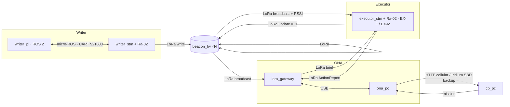

# Living Map — IEEE TSYP 14 (RAS × AESS)

Writer explores a GPS/network-denied site, detects events, drops RF beacons that persist and age honestly.
The ONA reads the beacons, translates them to GPS and briefs a far Command Post; the Executor enters
pre-briefed, navigates by beacons, acts (extinguish / first aid) and updates the beacons.

Architecture: [`docs/architecture/`](docs/architecture/) · Wire protocol: [`contracts/PROTOCOL.md`](contracts/PROTOCOL.md)

## Deployment map — one folder per thing you flash or run

| Physical unit | Folder | Runs |
|---|---|---|
| Writer · Raspberry Pi (ROS 2) | `targets/writer_pi/` | lidar, SLAM, exploration, CV, event detection, priority decision, beacon dropper/writer |
| Writer · STM32 | `targets/writer_stm/` | sensor nodes (gas, temp, smoke), encoders → odom, motors, recalibration, dropper servo |
| Beacon · ESP32-C3 + Ra-02 | `targets/beacon_fw/` | `lm_beacon_core`: stores payload, acks writes, broadcasts in its TDMA slot, NVS restore (SUSPECT) |
| ONA gateway · ESP32 + Ra-02 | `targets/lora_gateway/` | LoRa ↔ USB bridge: BeaconPayload → BeaconObs + RSSI, PC → air in the reader slot |
| Executor · STM32 | `targets/executor_stm/` | brief intake, beacon handler, actions taker, fire/first-aid nodes, beacon update |
| ONA · PC | `targets/ona_pc/` | beacons reader, area knowledge, situation + mission debrief |
| CP · PC | `targets/cp_pc/` | situation view, mission approval |
| Phase 1 sim · PC | `sim/` | whole mission, all agents, one process, spec rules enforced |



## The modularity rules
1. **One schema, three languages.** Every cross-device message lives in `contracts/schema.yaml`; `make gen` produces the C header, the Python module and the ROS msgs. Nobody hand-writes a struct twice.
2. **One framing everywhere.** `A5 5A | id | len | payload | crc16` on USB and inside LoRa packets (`libs/lm_embedded`, `libs/lm_core`); Pi↔STM is micro-ROS.
3. **Targets own I/O, libs own logic.** Bridges are the only code touching a port; logic modules never open a serial port.
4. **Python and C mirrors are tested against each other** (`tests/`): framing, struct layout, aging.
5. **Spec constraints are structural:** no Writer↔Executor link and no robot↔CP link exist in any target; the sim's runner rejects them at load.
6. **Add a sensor** = one `sensor_cfg_t` line. **Add an actuator** = one `actuator_node_t` file. **Add a message** = schema entry + `make gen`.

## Quick start
```bash
pip install pyyaml pyserial pytest
make test        # repo tests + sim tests (needs gcc/g++ for the C checks)
make sim         # Phase 1 mission end to end
```

## Open decisions (team)
- **Writer → ONA map upload at exit?** Today ONA only sees beacons (map = beacon chain). An upload of the occupancy grid would need a `MapChunk` message or Wi-Fi at the dock.
- **Beacon relay toward B0** (diagram "BEACONS COMS") vs. ONA reading B0 only.
- Sim: plain Python (`sim/`) for 05/10; `writer_pi` nodes import the same `lm_core` logic.
