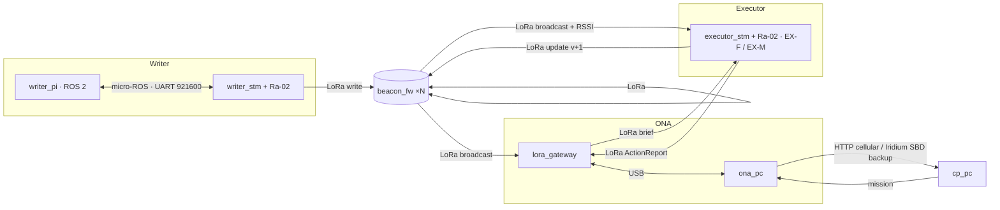

# Living Map — IEEE TSYP 14 (RAS × AESS)

Writer explores a GPS/network-denied site, detects events, drops RF beacons that persist and age honestly.
The ONA reads the beacons, translates them to GPS and briefs a far Command Post; the Executor enters
pre-briefed, navigates by beacons, acts (extinguish / first aid) and updates the beacons.

Architecture: [`docs/architecture/`](docs/architecture/) · Wire protocol: [`contracts/PROTOCOL.md`](contracts/PROTOCOL.md)

## Deployment map — one folder per thing you flash or run

| Physical unit | Folder | Runs | Links |
|---|---|---|---|
| Writer · Raspberry Pi (ROS 2) | [`targets/writer_pi/`](targets/writer_pi/) | micro-ROS agent, lidar, SLAM, exploration, CV, event detection, priority decision, beacon dropper/writer | `uros` → Writer STM |
| Writer · STM32 NUCLEO-L4R5ZI + Ra-02 | [`targets/writer_stm/`](targets/writer_stm/) | sensor nodes (gas, temp, smoke), odometry, IMU, motors, calibration, dropper servo, beacon writes | `uros` → Pi · `lora` → beacons |
| Beacon · ESP32-C3 + Ra-02 | [`targets/beacon_fw/`](targets/beacon_fw/) | `lm_beacon_core`: stores payload, acks writes, broadcasts in its TDMA slot, NVS restore (SUSPECT) | `lora` |
| ONA gateway · ESP32 + Ra-02 | [`targets/lora_gateway/`](targets/lora_gateway/) | LoRa ↔ USB bridge: BeaconPayload → BeaconObs + RSSI, PC → air in the reader slot | `lora` · `usb` → ONA PC |
| Executor EX-F / EX-M · STM32F103 + Ra-02 | [`targets/executor_stm/`](targets/executor_stm/) | brief intake, beacon handler, actions taker, fire **or** first-aid node (`-DEXECUTOR_TYPE`), beacon update | `lora` |
| ONA · PC | [`targets/ona_pc/`](targets/ona_pc/) | beacons reader, area knowledge, situation + mission debrief, CP link failover | `usb` → gateway · CP (cellular / satellite) |
| CP · PC | [`targets/cp_pc/`](targets/cp_pc/) | situation view, mission approval | CP ← ONA |
| Phase 1 sim · PC | [`sim/`](sim/) | whole mission, all agents, one process, spec rules enforced | in-process bus |

Link details (media, messages, TDMA): [`contracts/PROTOCOL.md`](contracts/PROTOCOL.md).



## The modularity rules
1. **One schema, three languages.** Every cross-device message lives in `contracts/schema.yaml`; `make gen` produces the C header, the Python module, the ROS msgs and the micro-ROS converters. Nobody hand-writes a struct twice; CI fails if `generated/` is stale.
2. **One framing everywhere.** `A5 5A | id | len | payload | crc16` on USB and inside LoRa packets (`libs/lm_embedded`, `libs/lm_core`); Pi↔STM is micro-ROS.
3. **Targets own I/O, libs own logic.** Board glue (pins, HAL) lives only in `board.c` / `main.cpp`; logic never opens a port.
4. **Python and C mirrors are tested against each other** (`tests/`): framing, struct layout, aging, airtime.
5. **Spec constraints are structural:** no Writer↔Executor link and no robot↔CP link exist in any target; the sim's runner rejects them at load.

## Strategy seams — swap an implementation without touching its callers

| Seam | Where | Implementations today |
|---|---|---|
| `lm_link_if_t` | `libs/lm_embedded/lm_link_if.h` | `lm_lora_as_link` (Ra-02), `lm_link_uart_as_link` (byte stream) |
| `uplink.h` | `targets/writer_stm/app/` | `uros_app.c` (micro-ROS), `tests/c/uplink_stub.c` (host) |
| `actuator_node_t` | `targets/executor_stm/app/executor.h` | `FIRE_ACTION_NODE` (EX-F), `FIRST_AID_NODE` (EX-M) |
| `sensor_cfg_t` | `targets/writer_stm/app/sensor_node.h` | gas, temp, smoke: one config line each |
| `policy()` | `targets/writer_pi/.../priority_decision.py` | severity × confidence bins (P1); bandit later |
| `CpLink` | `targets/ona_pc/ona/cp_link.py` | `HttpCellular`, `SatelliteSBD`, `Failover` |

**Add a sensor** = one `sensor_cfg_t` line. **Add an actuator** = one `actuator_node_t` file. **Add a message** = schema entry + `make gen`.

## Quick start
```bash
pip install pyyaml pyserial pytest
make test        # repo tests + sim tests (needs gcc/g++ for the C checks)
make sim         # Phase 1 mission end to end
```

## Open decisions (team)
- **Beacon relay toward B0** (beacon ↔ beacon forwarding so the ONA hears deep beacons): measure real LoRa range
  through walls first; with SF7 it may be unnecessary, or SF9 may be the cheaper fix.
- **Satellite driver is a stub.** `SatelliteSBD` builds the 300-byte payload but has no modem driver yet (RockBLOCK /
  Iridium 9603); the CP side needs `expand()` wired to the Iridium gateway delivery.
- **Pi 3 compute risk.** SLAM + Nav2 + CV on a Pi 3 may not keep up; measure CPU early, drop CV fps or offload.
- **Writer → ONA map upload at exit?** Today the ONA only sees beacons (map = beacon chain). Uploading the occupancy grid would need a `MapChunk` message or Wi-Fi at the dock.
- Sim: plain Python (`sim/`); it shares `libs/lm_core` (frame math, aging) with the ONA.
