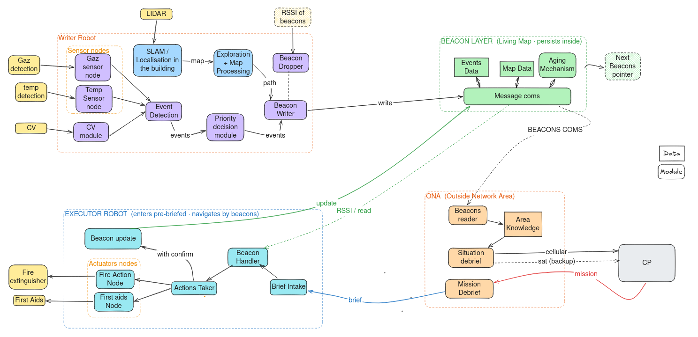
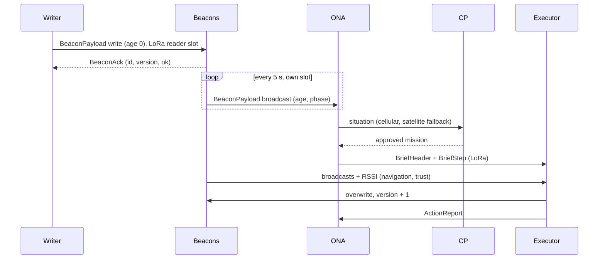
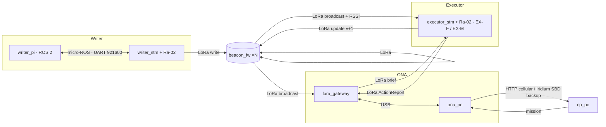

# Living Map — IEEE TSYP 14 (RAS × AESS)

Writer explores a GPS/network-denied site, detects events, drops RF beacons that persist and age honestly.
The ONA reads the beacons, translates them to GPS and briefs a far Command Post; the Executor enters
pre-briefed, navigates by beacons, acts (extinguish / first aid) and updates the beacons.

Architecture: [`docs/architecture/`](docs/architecture/) · Wire protocol: [`contracts/PROTOCOL.md`](contracts/PROTOCOL.md)

## How the system works

### The problem
After an accident, a building or tunnel is full of hazards (fire, smoke, gas, injured people), and it has no GPS
and no network inside. Sending people in blind is dangerous, but a robot inside can't reach anyone outside either:
walls block its radio and there is no infrastructure to relay through. The responders outside need to know what is
where, and how recent that knowledge is, before they commit a robot to fight a fire or reach a victim.

### The idea: a map that lives inside the building
The robots leave a *spatial memory* behind them: small RF beacons dropped along the path. Each beacon stores one
`BeaconPayload` ([`contracts/schema.yaml`](contracts/schema.yaml)):

- **WHAT**: event type (fire, gas, smoke, person, or plain junction), priority and detection confidence.
- **WHERE**: bearing and distance to the previous beacon. Together the beacons form a chain back to **B0** at the
  entrance, so positions can be rebuilt without GPS.
- **WHEN**: its age in seconds, counted by the beacon itself. There is no shared clock to sync.
- **VERSION**: incremented on every overwrite.

**The map ages honestly.** A reader turns age into trust: confidence decays as `conf · e^(−age/τ)`, where τ depends
on the event type (fire 2 min, smoke 3 min, gas 5 min, person 15 min). The result is **fresh** (≥ 0.7),
**aging** (≥ 0.4) or **stale**. A beacon that rebooted loses its age, so it flags itself **suspect** instead of
lying ([`libs/lm_core/aging.py`](libs/lm_core/aging.py), mirrored in C).
**The map stays alive:** a later robot that visits a beacon and acts there overwrites it with `version + 1`, so
newer knowledge wins everywhere.

### The actors

| Actor | Hardware | Role | Talks to |
|---|---|---|---|
| Writer robot | Raspberry Pi (ROS 2) + STM32 NUCLEO-L4R5ZI + Ra-02 | explores, detects events, drops and writes beacons | beacons (LoRa); Pi ↔ STM over micro-ROS |
| Beacons | ESP32-C3 + Ra-02 (LoRa 433 MHz) | store one payload, count their age, broadcast it in their time slot | everyone in LoRa range |
| ONA (Outside Network Area) | PC + `lora_gateway` (ESP32 + Ra-02 on USB) | reads beacons at the entrance, converts them to GPS, briefs the Executors | beacons and Executors (LoRa), CP |
| Command Post | PC, far away | sees the situation, approves a mission | ONA only |
| Executor EX-F (fire) | STM32F103 + Ra-02 + extinguisher pump | follows the beacons, extinguishes, updates beacons | beacons, ONA (LoRa) |
| Executor EX-M (first aid) | STM32F103 + Ra-02 + kit servo | follows the beacons, delivers a first-aid kit, updates beacons | beacons, ONA (LoRa) |



### A mission, start to finish
1. The **Writer** enters. At startup it calibrates the STM (encoders reset so the map origin is the entrance, gas
   and smoke baselines, IMU bias) and drops **B0**.
2. It explores with SLAM (`slam_toolbox`, lidar + wheel odometry + IMU).
3. It detects events: STM sensor nodes (gas, temperature, smoke, each filtered and debounced on the MCU) and a
   camera person detector on the Pi (model still TODO).
4. **Event detection** tags each event with the robot's pose and removes duplicates. **Priority decision** grades it
   from IGNORE to IMMEDIATE.
5. The **beacon dropper** releases a beacon when the spacing, the RSSI of the last beacon or an event requires one.
   The **beacon writer** fills its payload, and the STM sends it over LoRa until the beacon acks it.
6. The Writer returns to the entrance (return trigger still TODO).
7. The **ONA** listens through its LoRa gateway. It rebuilds every beacon's position from the chain, converts it to
   GPS with the entrance fix and heading, and computes each beacon's aging state.
8. It sends this situation to the **CP** over cellular. If cellular fails it falls back to satellite, using a
   300-byte compact payload with the most urgent events first (modem driver still a stub).
9. An operator at the CP approves a mission: a list of steps (beacon, action, event).
10. The ONA sends the brief over LoRa. Both Executors hear it; each acts only on the steps it can do
    (EXTINGUISH → EX-F, FIRST_AID → EX-M) and reports the others as ABORTED.
11. The **Executor** homes on the beacons by RSSI. A stale beacon goes through a VERIFY step (own-sensor check
    still TODO), and a suspect one is skipped. Then it acts, overwrites the beacon (`version + 1`, flags verified +
    action done) and broadcasts an `ActionReport`, which the ONA receives while it is in range.



### Communication rules (from the challenge spec)
- No direct Writer ↔ Executor link and no robot ↔ CP link. Everything crosses the boundary through the beacons and
  the ONA. The sim refuses to load a wiring that breaks this.
- All radio is LoRa, which is half-duplex: a frame takes about 60 ms on air. Nodes therefore share the channel in
  TDMA slots: 5 s period, 25 × 200 ms slots, beacon *i* in slot *i* mod 24, and slot 24 reserved for the robots and
  the ONA. There is no shared clock inside, so every node keeps its slots aligned with the `phase_ms` carried in each
  beacon broadcast ([PROTOCOL.md](contracts/PROTOCOL.md#lora-tdma-libslm_embeddedlm_slotsc)).
- ONA ↔ CP: cellular, with satellite as the failover.

### Key design choices
- **One schema → C / Python / ROS msgs**: the STM, the ESP32s, the Pi, the ONA and the sim can't drift apart, and CI checks it.
- **Strategy interfaces at every hardware seam** (`lm_link_if_t`, `uplink.h`, `actuator_node_t`, `CpLink`, ...): swap a radio, a transport or a robot type without touching its callers, and test logic on a PC.
- **micro-ROS between the Pi and the STM**: the STM is a normal ROS node (topics, a service, QoS) instead of a hand-written serial bridge.
- **Beacons count their own age**: no clock sync is needed in a building with no GPS or network; readers do the trust math.
- **One Executor firmware, two robot types via a build flag**: `-DEXECUTOR_TYPE=EX_FIRE|EX_MED` shares all navigation and beacon logic and compiles in only the matching actuator.
- **The sim enforces the spec rules at load time**: a forbidden link is a startup error, not a review comment.

## Deployment map — one folder per thing you flash or run

| Physical unit | Folder | Runs | Links |
|---|---|---|---|
| Writer · Raspberry Pi (ROS 2) | [`targets/writer_pi/`](targets/writer_pi/) | micro-ROS agent, lidar, SLAM, exploration, CV, event detection, priority decision, beacon dropper/writer | `uros` → Writer STM |
| Writer · STM32 NUCLEO-L4R5ZI + Ra-02 | [`targets/writer_stm/`](targets/writer_stm/) | sensor nodes (gas, temp, smoke), odometry, IMU, motors, calibration, dropper servo, beacon writes | `uros` → Pi · `lora` → beacons |
| Beacon · ESP32-C3 + Ra-02 | [`targets/beacon_fw/`](targets/beacon_fw/) | `lm_beacon_core`: stores payload, acks writes, broadcasts in its TDMA slot, NVS restore (SUSPECT) | `lora` |
| ONA gateway · ESP32 + Ra-02 | [`targets/lora_gateway/`](targets/lora_gateway/) | LoRa ↔ USB bridge: BeaconPayload → BeaconObs + RSSI, PC → air in the reader slot | `lora` · `usb` → ONA PC |
| Executor EX-F / EX-M · STM32F103 + Ra-02 | [`targets/executor_stm/`](targets/executor_stm/) | brief intake, beacon handler, actions taker, fire **or** first-aid node (`-DEXECUTOR_TYPE`), beacon update | `lora` |
| ONA · PC | [`targets/ona_pc/`](targets/ona_pc/) | beacons reader, area knowledge, situation + mission debrief, CP link failover | `usb` → gateway · CP (cellular / satellite) |
| CP · PC | [`targets/cp_pc/`](targets/cp_pc/) | situation view, mission approval | CP ← ONA |
| Phase 1 sim · PC | [`sim/`](sim/) | whole mission, all agents, one process, spec rules enforced | in-process bus |

Link details (media, messages, TDMA): [`contracts/PROTOCOL.md`](contracts/PROTOCOL.md).



## The modularity rules
1. **One schema, three languages.** Every cross-device message lives in `contracts/schema.yaml`; `make gen` produces the C header, the Python module, the ROS msgs and the micro-ROS converters. Nobody hand-writes a struct twice; CI fails if `generated/` is stale.
2. **One framing everywhere.** `A5 5A | id | len | payload | crc16` on USB and inside LoRa packets (`libs/lm_embedded`, `libs/lm_core`); Pi↔STM is micro-ROS.
3. **Targets own I/O, libs own logic.** Board glue (pins, HAL) lives only in `board.c` / `main.cpp`; logic never opens a port.
4. **Python and C mirrors are tested against each other** (`tests/`): framing, struct layout, aging, airtime.
5. **Spec constraints are structural:** no Writer↔Executor link and no robot↔CP link exist in any target; the sim's runner rejects them at load.

## Strategy seams — swap an implementation without touching its callers

| Seam | Where | Implementations today |
|---|---|---|
| `lm_link_if_t` | `libs/lm_embedded/lm_link_if.h` | `lm_lora_as_link` (Ra-02), `lm_link_uart_as_link` (byte stream) |
| `uplink.h` | `targets/writer_stm/app/` | `uros_app.c` (micro-ROS), `tests/c/uplink_stub.c` (host) |
| `actuator_node_t` | `targets/executor_stm/app/executor.h` | `FIRE_ACTION_NODE` (EX-F), `FIRST_AID_NODE` (EX-M) |
| `sensor_cfg_t` | `targets/writer_stm/app/sensor_node.h` | gas, temp, smoke: one config line each |
| `policy()` | `targets/writer_pi/.../priority_decision.py` | severity × confidence bins (P1); bandit later |
| `CpLink` | `targets/ona_pc/ona/cp_link.py` | `HttpCellular`, `SatelliteSBD`, `Failover` |

**Add a sensor** = one `sensor_cfg_t` line. **Add an actuator** = one `actuator_node_t` file. **Add a message** = schema entry + `make gen`.

## Quick start
```bash
pip install pyyaml pyserial pytest
make test        # repo tests + sim tests (needs gcc/g++ for the C checks)
make sim         # Phase 1 mission end to end
```

## Open decisions (team)
- **Beacon relay toward B0** (beacon ↔ beacon forwarding so the ONA hears deep beacons): measure real LoRa range
  through walls first; with SF7 it may be unnecessary, or SF9 may be the cheaper fix.
- **Satellite driver is a stub.** `SatelliteSBD` builds the 300-byte payload but has no modem driver yet (RockBLOCK /
  Iridium 9603); the CP side needs `expand()` wired to the Iridium gateway delivery.
- **Pi 3 compute risk.** SLAM + Nav2 + CV on a Pi 3 may not keep up; measure CPU early, drop CV fps or offload.
- **Writer → ONA map upload at exit?** Today the ONA only sees beacons (map = beacon chain). Uploading the occupancy grid would need a `MapChunk` message or Wi-Fi at the dock.
- Sim: plain Python (`sim/`); it shares `libs/lm_core` (frame math, aging) with the ONA.
