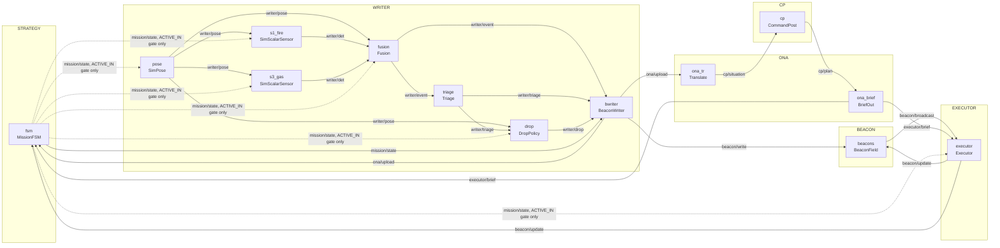
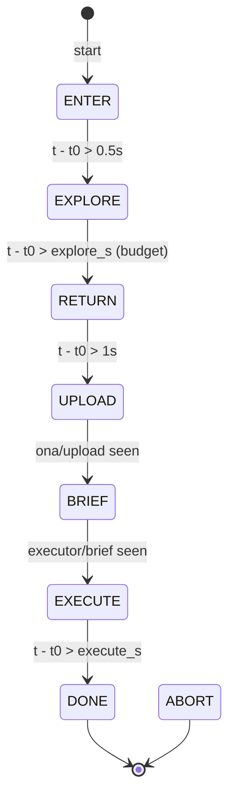

# Living Map — module graph

IEEE TSYP 14 "Living Map: Spatial Memory for Emergency Robots". P1 = simulation
(due 05/10/2026). P2 = physical prototype (01/12/2026).

```
contracts/   messages.py (typed msgs), topics.py (topic -> type, owner zone), beacon.h (TODO: wire format for firmware)
core/        module.py (Module contract), bus.py (InProcBus; MQTT/serial later), zones.py (spec rules), runner.py (wire + validate + tick)
modules/     strategy/ writer/ beacon/ ona/ cp/ executor/   — one file per box in the architecture diagram
sim/         world.py (ground truth; only sim_* drivers may read it), faults.py (TODO)
config/      wiring.yaml (the graph), scenarios/*.yaml (failure cases, TODO)
firmware/    writer_esp32/, beacon_esp32c3/  (P2)
tests/       contract + spec-violation tests
```

See each folder's own README.md for its file/class/topic table and contribution rules:
[contracts/](contracts/README.md) · [core/](core/README.md) · [sim/](sim/README.md) ·
[config/](config/README.md) · [tests/](tests/README.md) ·
[modules/writer/](modules/writer/README.md) · [modules/beacon/](modules/beacon/README.md) ·
[modules/ona/](modules/ona/README.md) · [modules/cp/](modules/cp/README.md) ·
[modules/executor/](modules/executor/README.md) · [modules/strategy/](modules/strategy/README.md)

## Module graph

Generated from `config/wiring.yaml` (module -> `impl:` class, `ZONE`) and each class's
`INPUTS`/`OUTPUTS` (topic -> type, from `contracts/topics.py`). Edges are topics;
grouping is by `ZONE`.



Dashed edges are `mission/state` consumed implicitly by `core/runner.py` for every
module's `ACTIVE_IN` gate (see `Runner.tick`), not a declared `INPUTS` entry. Only
`bwriter` lists `mission/state` as an explicit `INPUTS` topic, because it needs the
message itself (to know when to upload), not just the gate.

Spec rules enforced by `core/zones.py` and checked by `core/runner.py:validate()`:
all inside<->outside traffic goes through ONA (`bwriter -> ona_tr`, `ona_brief ->
executor`); no WRITER<->EXECUTOR edge exists; no robot<->CP edge exists; STRATEGY only
ever emits `mission/state` (no data relay).

## Mission FSM

From `modules/strategy/mission_fsm.py:MissionFSM.step`. `explore_s`/`execute_s` are
`wiring.yaml` params (defaults 40s/5s); other transitions are fixed small delays or
"has this topic fired since the last transition" checks.



`ABORT` is a defined `MissionState` but no transition into it exists yet in
`mission_fsm.py` — TODO (failure-triggered abort path).

## Setup, run, test

```bash
# from the repo root
python -m venv .venv && source .venv/bin/activate
pip install pyyaml pytest

python run.py                 # runs config/wiring.yaml for duration_s, prints topic summary
python run.py path/to/other.yaml   # or any other wiring file

pytest -q                     # contract + spec-violation tests
```

## How to add a module

1. Pick its `ZONE` (one of `core.zones.Zone`) — this decides what it may publish and
   what it may subscribe to, per `core/zones.py`'s `ALLOWED` table.
2. Write the class in the right `modules/<zone>/` package, subclassing `core.module.Module`.
   Declare `ZONE`, `INPUTS`, `OUTPUTS` (topic names that already exist in
   `contracts/topics.py`, or that you add there first), and optional `ACTIVE_IN`.
3. If it needs a new message type or topic, add the dataclass to `contracts/messages.py`
   and the topic entry (`type`, owning zone) to `contracts/topics.py` first — never
   invent an ad hoc shape inside the module.
4. Implement `step(t, inbox) -> {topic: [msgs]}`. No I/O, no globals, no importing other
   `modules/*` packages — only `contracts/` and `core/` (plus `sim/` if it's a sim-only
   ground-truth driver).
5. Add a `modules:` entry to `config/wiring.yaml` with `name`, `impl:` (dotted path to
   the class), and `params:`. Run `pytest -q` — `test_full_graph_valid` and
   `core/runner.py:validate()` will catch any topic/zone violation before you run the sim.

## Sim -> hardware

Swapping simulation for real hardware is a `config/wiring.yaml` edit, not a code change:
point a module's `impl:` at a hardware-backed class with the same `INPUTS`/`OUTPUTS`
topic names (e.g. `modules.writer.sensor.SimScalarSensor` -> a real MQ-7/thermal driver
class). Topics, message types, and zone rules never change between sim and hardware —
only what's on the other end of `Bus.publish`/`drain`. The `Bus` transport itself also
swaps this way: `core.bus.InProcBus` (sim) -> `MqttBus`/`SerialBus` (P2, not yet
implemented), both satisfying the same `Bus` protocol in `core/bus.py`.

## Rules

1. Modules import only `contracts/` and `core/`. Never each other.
2. A module declares `ZONE`, `INPUTS`, `OUTPUTS`, optional `ACTIVE_IN`; implements `step(t, inbox) -> {topic: [msgs]}`.
3. Every message has a `Header(stamp, source, frame, seq)`. Frame is explicit; translation asserts it.
4. Topic ownership + zone edges are checked at load. Writer↔Executor or robot↔CP wiring fails before the sim runs.
5. `step` is deterministic given `params.seed` → every failure case is a replayable scenario file.
6. Sim vs HW = swap `impl:` in the YAML (e.g. `SimScalarSensor` → `Mq7Driver`). Topics don't change.
